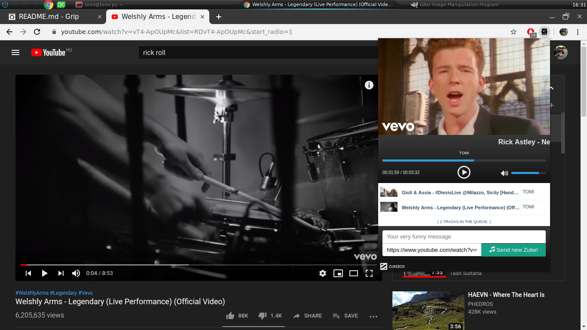

zukebox: Juke Box
=================

ZukeBox is a **Juke Box** made out of YouTube. Install it on a Raspberry pi and play music in your office.

What's this?

 - zuke:
    - a music from youtube
    - an optional message that will be read using google text to speech

 - zukebox server:
    - simple REST api for sending/playing zuke(s) from YouTube
    - downloads ytdl (npm package) and keeps it up to date, see *$HOME/.cache/zukebox/npm*
    - get the stream url using ytdl and play the music using vlc

 - chrome extension:
    - an easy way to send zuke(s)


 

Developing
----------

    $ pacman -S go-tools npm vlc curl jq       # install the dependencies
    $ go build                                 # build
    $ ./zukebox                                # run

Installation
------------

**NOTE** this *Installation* part is just a plan - not ready yet!

The easiest way to install on **archlinux**

    $ git clone https://github.com/tomicooler/zukebox.git
    $ cd zukebox
    $ makepkg -si

Open google chrome browser, go to the ``chrome://extensions/`` enable **Developing mode** and **Load unpacked**
extension then add */usr/share/zukebox/chrome*.
Go to youtube search for your favorite song click on zukebox icon and *Send zuke*!


REST API
--------


**Adding a track**

```shell
$ curl -X POST "localhost:5000/player/tracks" -H 'Content-Type: application/json' -d'
{
   "user": "Tomi",
   "url": "https://www.youtube.com/watch?v=dQw4w9WgXcQ",
   "message": "Please read this before the music starts!",
   "lang": "en"
}
' 2>/dev/null | jq .
```

```json
{
  "ID": "dQw4w9WgXcQ",
  "url": "https://www.youtube.com/watch?v=dQw4w9WgXcQ",
  "user": "Tomi",
  "message": "Please read this before the music starts!",
  "lang": "en",
  "duration": 212,
  "title": "Rick Astley - Never Gonna Give You Up (Video)",
  "thumbnail": "https://i.ytimg.com/vi/dQw4w9WgXcQ/maxresdefault.jpg"
}
```

**Getting the tracks**

    $ curl -X GET "localhost:5000/player/tracks" 2>/dev/null | jq .

```json
{
  "tracks": [
    {
      "ID": "AnK65v9AcOo",
      "url": "https://www.youtube.com/watch?v=AnK65v9AcOo",
      "user": "Robi",
      "message": "",
      "lang": "",
      "duration": 316,
      "title": "Belga - Boros",
      "thumbnail": "https://i.ytimg.com/vi/AnK65v9AcOo/hqdefault.jpg"
    },
    {
      "ID": "1UzZUfFUnxY",
      "url": "https://www.youtube.com/watch?v=1UzZUfFUnxY",
      "user": "Laci",
      "message": "Not this genre!",
      "lang": "en",
      "duration": 328,
      "title": "JAMES BROWN - Sex machine (Long 12'' Version Videoclip)",
      "thumbnail": "https://i.ytimg.com/vi/1UzZUfFUnxY/maxresdefault.jpg"
    }
  ]
}
```

**Get a track**

    $ curl -X GET "localhost:5000/player/tracks/2" 2>/dev/null | jq .

```json
{
  "ID": "1UzZUfFUnxY",
  "url": "https://www.youtube.com/watch?v=1UzZUfFUnxY",
  "user": "Laci",
  "message": "Not this genre!",
  "lang": "en",
  "duration": 328,
  "title": "JAMES BROWN - Sex machine (Long 12'' Version Videoclip)",
  "thumbnail": "https://i.ytimg.com/vi/1UzZUfFUnxY/maxresdefault.jpg"
}
```

**Remove a track**

    $ curl -X DELETE "localhost:5000/player/tracks/2"

**Getting the recent tracks**

    $ curl -X GET "localhost:5000/player/recent-tracks" 2>/dev/null | jq .

```json
{
  "tracks": [
    {
      "ID": "tezjI5j9z8U",
      "url": "https://www.youtube.com/watch?v=tezjI5j9z8U",
      "user": "Tomi",
      "message": "",
      "lang": "",
      "duration": 245,
      "title": "Belga-Fizetésnap",
      "thumbnail": "https://i.ytimg.com/vi/tezjI5j9z8U/maxresdefault.jpg"
    }
  ]
}
```

**Get the player status**

    $ curl -X GET "localhost:5000/player/control" 2>/dev/null | jq .

```json
{
  "playing": true,
  "volume": 100,
  "time": 269,
  "track": {
    "ID": "AnK65v9AcOo",
    "url": "https://www.youtube.com/watch?v=AnK65v9AcOo",
    "user": "Robi",
    "message": "",
    "lang": "",
    "duration": 316,
    "title": "Belga - Boros",
    "thumbnail": "https://i.ytimg.com/vi/AnK65v9AcOo/hqdefault.jpg"
  }
}
```

**Set the volume**

```shell
curl -X PATCH "localhost:5000/player/control" -H 'Content-Type: application/json' -d'
{
   "volume": 50
}
' 2>/dev/null | jq .
```

**Seek**

```shell
curl -X PATCH "localhost:5000/player/control" -H 'Content-Type: application/json' -d'
{
   "time": 42
}
' 2>/dev/null | jq .
```

**Play/Pause**

```shell
curl -X PATCH "localhost:5000/player/control" -H 'Content-Type: application/json' -d'
{
   "playing": false
}
' 2>/dev/null | jq .
```

Copyright & License
-------------------

  * Copyright 2015, Tamas Domok
  * License: MIT
